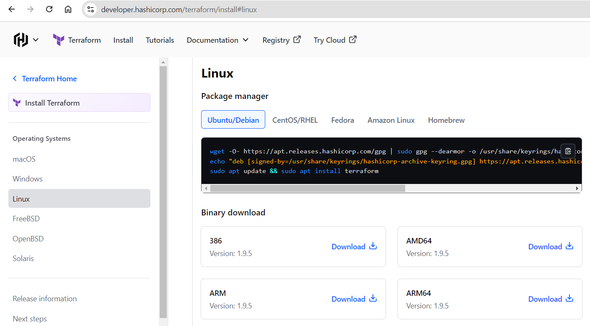
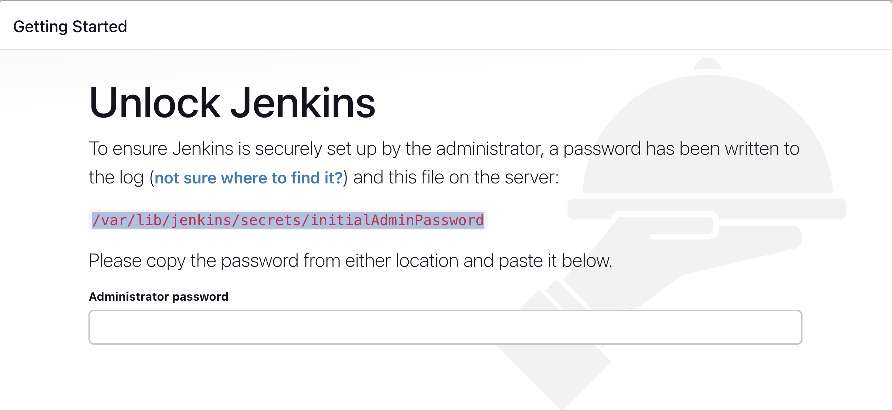
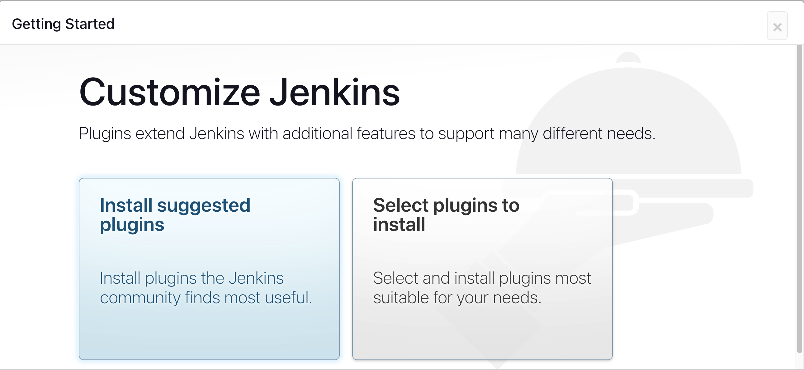
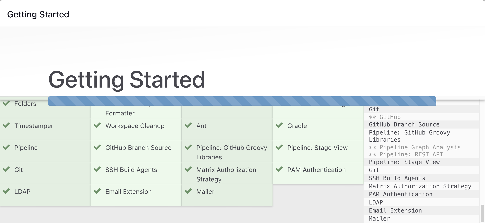
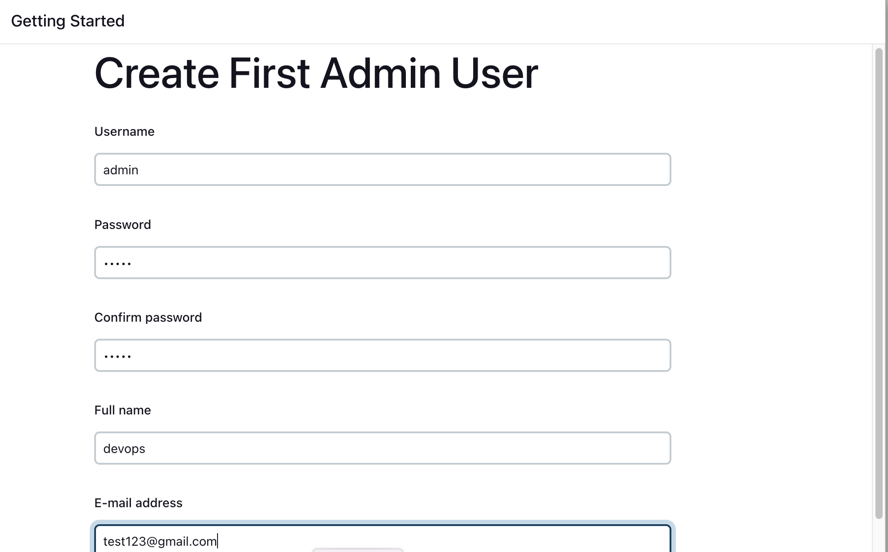
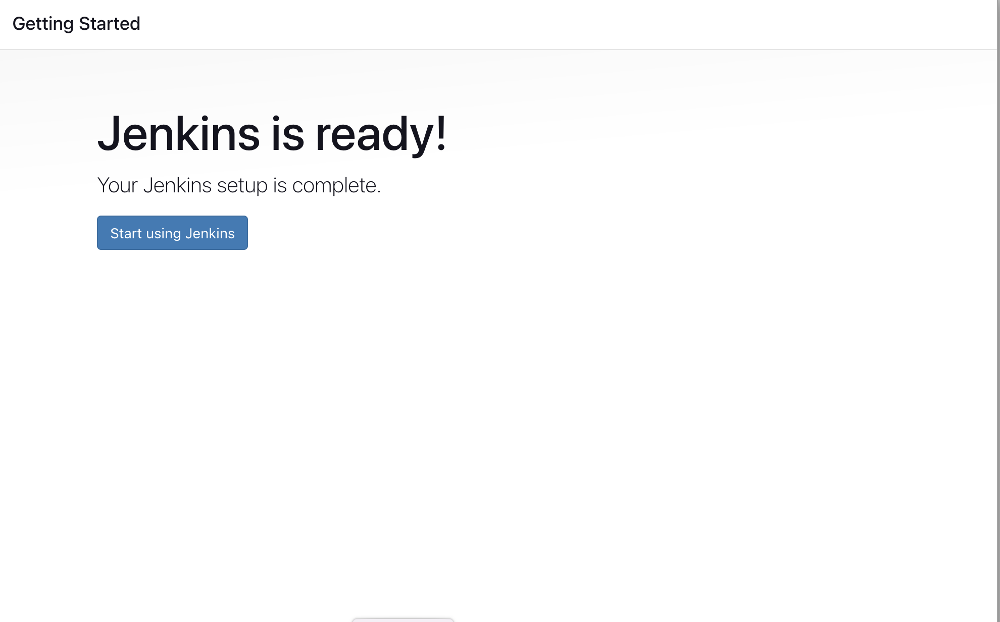
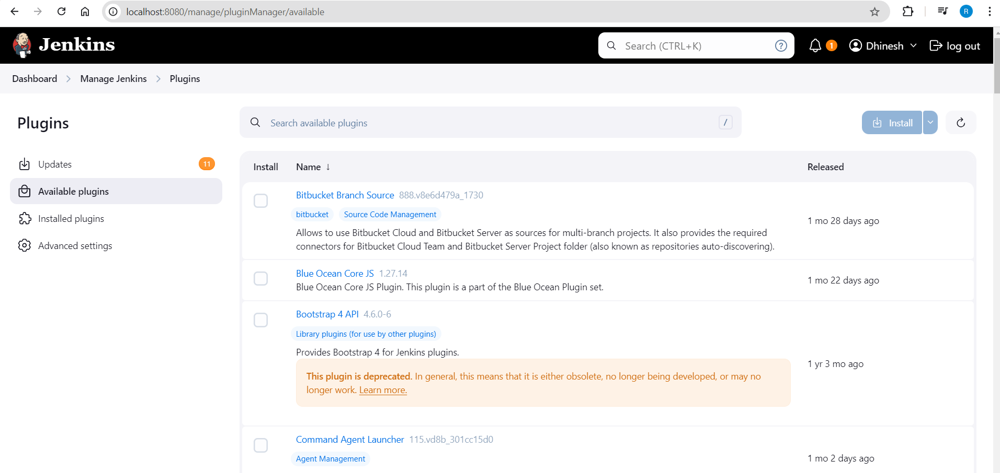

# Jenkins
Azure Infra creation using Terraform Jenkins Pipeline

1. Install the Jenkins

Installation of Java

2. Jenkins requires Java to run, yet not all Linux distributions include Java by default. Additionally, not all Java versions are compatible with Jenkins.

sudo apt update
sudo apt install fontconfig openjdk-17-jre

3. Installation of Java

sudo wget -O /usr/share/keyrings/jenkins-keyring.asc \
  https://pkg.jenkins.io/debian-stable/jenkins.io-2023.key
echo "deb [signed-by=/usr/share/keyrings/jenkins-keyring.asc]" \
  https://pkg.jenkins.io/debian-stable binary/ | sudo tee \
  /etc/apt/sources.list.d/jenkins.list > /dev/null

sudo apt-get update
sudo apt-get install jenkins

5. Start Jenkins

Enable the Jenkins service to start at boot with the command:
sudo systemctl enable jenkins

6. Start the Jenkins service with the command:

sudo systemctl start jenkins

7. You can check the status of the Jenkins service using the command:

sudo systemctl status jenkins

If Machine have a firewall installed, you must add Jenkins as an exception. You must change YOURPORT in the script below to the port you want to use. Port 8080 is the most common.

# Steps to install terraform on Ubuntu 
1. Install unzip:

sudo apt-get install unzip

2. Confirm the latest version number on the terraform website:
https://www.terraform.io/downloads.html

3. Download latest version of the terraform (substituting newer version number if needed):

wget https://releases.hashicorp.com/terraform/1.9.5/terraform_1.9.5_linux_amd64.zip

4. Extract the downloaded file archive:

unzip terraform_1.9.5_linux_amd64.zip

5. Move the executable into a directory searched for executables:

sudo mv terraform /usr/local/bin/

6. Check the Terraform installed or not using below command:

terraform -version

Accessing Jenkins 

Login to Jenkins using the below URL:

http://:8080 [You can get the Azure vm -instance-public-ip-address from your Azure page]

After you login to Jenkins, - Run the command to copy the Jenkins Admin Password - sudo cat /var/lib/jenkins/secrets/initialAdminPassword - Enter the Administrator password

Click on Install suggested plugins

Wait for the Jenkins to Install suggested plugins

Create First Admin User or Skip the step [If you want to use this Jenkins instance for future use-cases as well, better to create admin user]

Jenkins Installation is Successful. You can now starting using the Jenkins

Install Required plugins from manage jenkins/plugin/Available plugins

